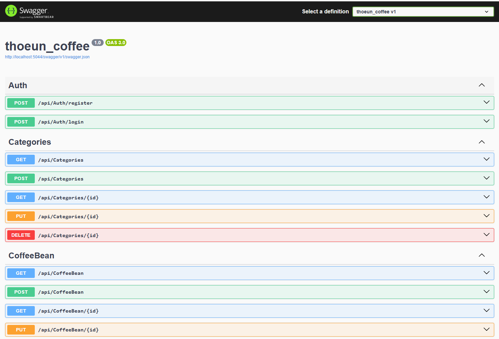
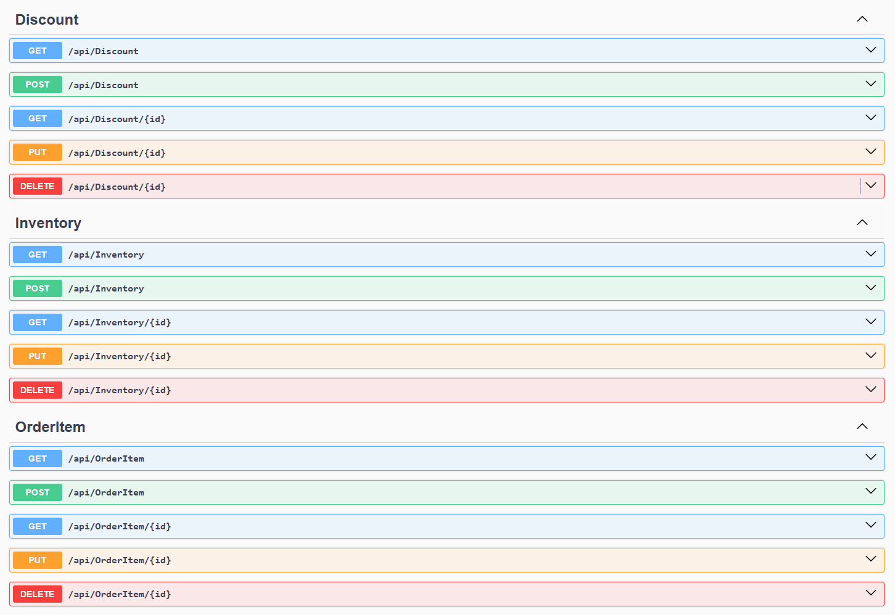
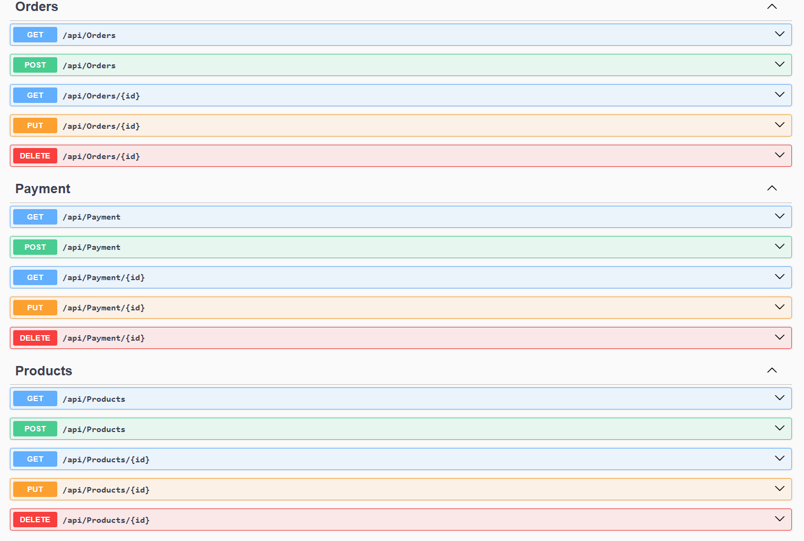
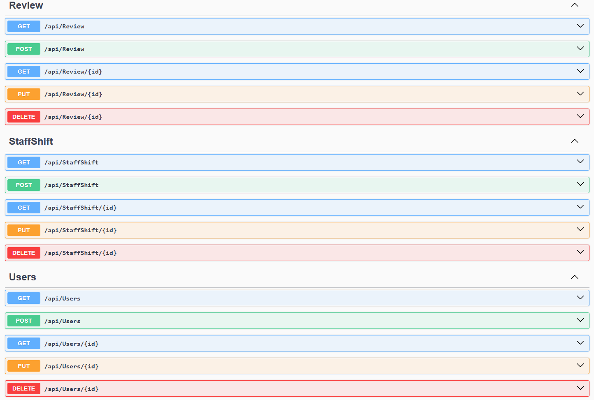

# Coffee API






## Relation

### Summary of Relationships:
- **Users and Orders**: One-to-many (A user can place many orders).
- **Orders and Order_Items**: One-to-many (Each order can have many items).
- **Products and Order_Items**: Many-to-many (Each product can appear in many orders, and each order can contain many products).
- **Orders and Payments**: One-to-one (Each order has one payment).
- **Products and Inventory**: One-to-one (Each product has a corresponding inventory entry).
- **Users and Reviews**: One-to-many (A user can leave many reviews).
- **Products and Reviews**: One-to-many (A product can have many reviews).

---

## Setting Up the Project

### Requirements
- .NET SDK 8.0
- MySQL Database

---

### Steps to Run the API:

1. **Clone the Repository:**
   ```bash
   git clone https://github.com/RABUNTHOEUN/coffee_api.git
Create the Database:

Create a new database named coffee in MySQL.
Apply Migrations:

Run the following command to apply the database migration:

dotnet ef database update
If no migration exists, create one using:

dotnet ef migrations add InitialCreate
Then, run the update command again:

dotnet ef database update
Run the Application:


dotnet watch run
Steps to Run the Dashboard:
Clone the Dashboard Repository:


git clone https://github.com/RABUNTHOEUN/coffee-dashboard.git
Install Dependencies:


npm install
Start the Development Server:


npm run dev
Contribution
Feel free to fork the repository and submit pull requests to contribute to the project.

License
This project is open-source and available under the MIT License.

Contact
For any queries or issues, feel free to contact:

Name: Ra Bunthoeun
Email: rabunthoeun@gmail.com
Website: longsoeng.website
YouTube Channel: @rabunthoeun7105
Happy coding! 🚀